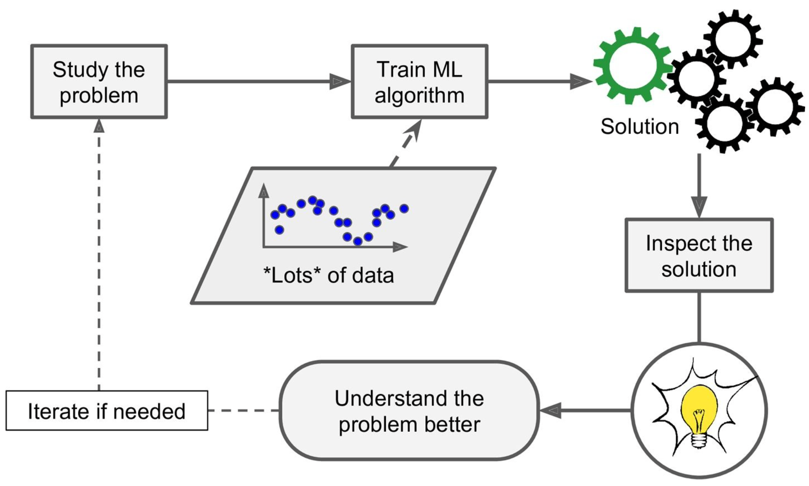
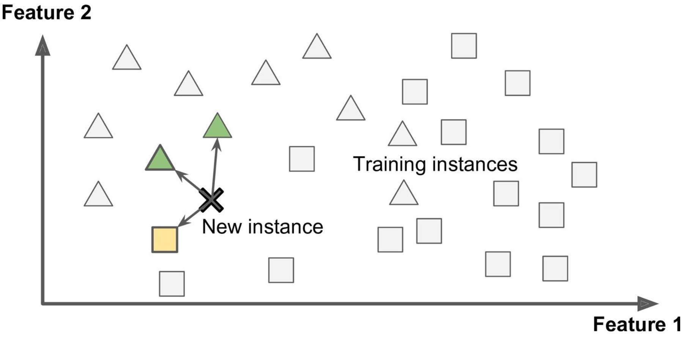
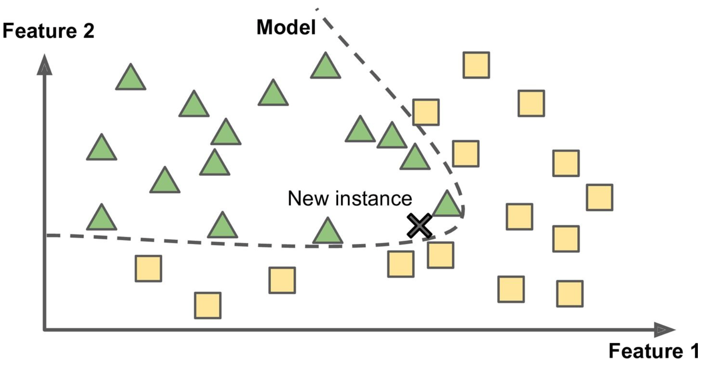
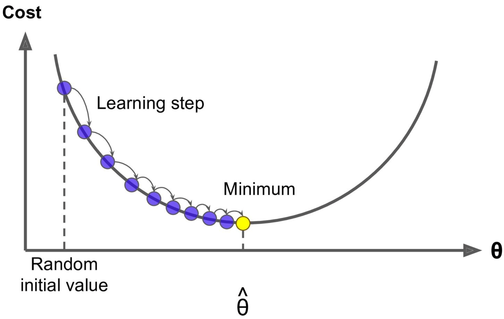

# **Machine Learning Scikit/Tensorflow**

## **Chapter 1: The Machine learning Landscape**

### **What is it?**
Machine learning is the science and art of programming computers so they can **learn from data.** It automatically (or is told to) learn patterns from data by detecting the frequency at which certain events occur. 



**Machine learning is great for:**
1. **Simplifying** the solution to complex problems
2. **Identifying** a solution for complex problems that have yet to find a solution
3. **Adapting** to dynamic environments and new data
4. **Getting** insights and drawing patterns from large amounts of data

### **Types of Machine Learning**
**Supervised Learning** is when you give an algorithm training data, which include labels, to train a model to recognize certain patterns. A common example of this is **classification**, such as the spam filter that learns how to sort emails into their respective classes (spam or ham). **Regression** is another typical task, where a model can be trained to predict a target number, such as the price of a car or house. 

**Supervised Learning Algorithms:**
- k-Nearest Neighbor
- Linear Regression
- Logistic Regression
- Support Vector Machines (SVMs)
- Decision Trees and Random Forests
- Neural networks

**Unsupervised Learning** is the opposite; the training data is unlabeled and it's up to the model to learn and identify patterns. One example of this is clustering users of an app based on their behavior and demographics. An important task within unsupervised learning is **dimensionality reduction**, which is to simplify data without losing too much information; this is done by looking at which correlated features can be merged into one all-encompassing feature.

**Unsupervised Learning Algorithms**:
- Clustering
  - k-Means
  - Hierarchical Cluster Analysis (HCA)
  - Expectation Maximization
- Visualization and dimensionality reduction
  - Principal Component Analysis (PCA)
  - Kernel PCA
  - Locally-Linear Embedding (LLE)
  - t-distributed Stochastic Neighbor Embedding (t-SNE)
- Association rule learning 
  - Apriori
  - Eclat

**Reinforcement Learning**, on the other hand, depends on an *agent* in an environment. It takes a trial and error strategy, allowing the agent to select and perform actions and receive corresponding rewards, encouraging it to learn the **best policy** to get the highest reward overtime.

**Batch Learning**, also called offline learning is a type of machine learning that requires all information at one time to make conclustions on patterns. In contrast, **Online Learning** allows a system to be trained incrementally, making it able to grasp new insights as it trains.Online learning is much faster, cheaper, and great for systems that are continuously receiving new data.

**Instance-Based Learning** uses similarity metrics to flag similar occurances based on certain features. For example, with a spam filter, an instance-based learning would identify a new occurance based on (a very basic example) the number of mispelled words and how similar it is to a known email occurance


 
In contrast, **Model-Based Learning** builds a model, such as linear, quadratic, exponential, etc. with these examples based on features and categorizes new instances based on where it falls in the model. The model-based learning model would use the previous features and identify the new instance based on where it falls in the model.



```
import matplotlib
import matplotlib.pyplot as plt import numpy as np
import pandas as pd
import sklearn
# Load the data
oecd_bli = pd.read_csv("oecd_bli_2015.csv", thousands=',')
gdp_per_capita = pd.read_csv("gdp_per_capita.csv",thousands=',',delimiter='\t',
encoding='latin1', na_values="n/a")
# Prepare the data
country_stats = prepare_country_stats(oecd_bli, gdp_per_capita) X = np.c_[country_stats["GDP per capita"]]
y = np.c_[country_stats["Life satisfaction"]]
# Visualize the data
country_stats.plot(kind='scatter', x="GDP per capita", y='Life satisfaction') plt.show()
# Select a linear model
lin_reg_model = sklearn.linear_model.LinearRegression() # Train the model
 
lin_reg_model.fit(X, y)
# Make a prediction for Cyprus
X_new = [[22587]] # Cyprus' GDP per capita print(lin_reg_model.predict(X_new)) # outputs [[ 5.96242338]]
```

### Challenges in Machine Learning

**Bad Data**
- insufficient quality of training data
- nonrepresentative training data
- poor quality data with outliers and noise
- irrelevent features
**Bad Model**

### Testing and Validating

It is common to have an **80/20 split** for training and testing data. However, a more rigorous way to test for the most optimal model is to have a second holdout set called a **validation set**, which would aid in selecting the correct model.

## **Chapter 2: End-to-End Machine Learning Project**

**Main Steps:**
1. Look at the big picture.
2. Get the data.
3. Discover and visualize the data to gain insights. 
4. Prepare the data for Machine Learning algorithms. 
5. Select a mode land train it.
6. Fine-tune your model.
7. Present your solution.
8. Launch, monitor, and maintain your system.

## Chapter 4: Training Models

### Linear Regression Model
There are two different ways to train a linear regression model: using a direct **"closed-form" equation** or an iterative optimization approach, or **Gradient Descent** (GD).

#### Closed-Form
The linear model makes a prediction through a weighted sum of different input features, plus a bias term (the y-intercept):

$y = \theta_0 + \theta_1x_1 + \theta_2x_2 + ... + \theta_{n}x_n$

y = predicted value, n = # of features, $x_i$ is the ith feature value, and $\theta_{j}$ is the jth model parameter aka feature weights ($\theta_0$ is the bias).

**Vectorized Form**
Simplified in vectorized form: $y = h_\theta(x) = \theta^T * x$. This equation turns the $\theta^T$ into a parameter row vector, and x is the feature column vector (x_0 = 1 for the bias). The dot product of the two is the hypothesis function $h_{\theta}$. 

**Training**
The most common performance of a regression model is the Root Mean Squares Error (RMSE), which can be found with the Mean Square Error, which converges easier than the RMSE and leads to the same result. 

$MSE(X, h_{\theta}) = \frac{1}{m} \sum^m_{i=1} (\theta^T * x^i - y^i)^2$

**The Normal Equation**
We can get the minimizing $\theta$ value with a closed-form solution called the normal equation: $\theta = (X^T * X)^{-1} * X^T * y$, where $y$ is a vector of target values.

**Raw Example**
```
>>> import numpy as np
>>> X_b = np.c_[np.ones((100, 1)), X]   # add x0 = 1 to each instance
>>> theta_best = np.linalg.inv(X_b.T.dot(X_b)).dot(X_b.T).dot(y)
>>> theta_best
array([[ 4.21509616], [ 2.77011339]])
>>> X_new = np.array([[0], [2]])
>>> X_new_b = np.c_[np.ones((2, 1)), X_new]   # add x0 = 1 to each instance 
>>> y_predict = X_new_b.dot(theta_best)
>>> y_predict
array([[ 4.21509616], [ 9.75532293]])
```

**Scikit Example**
```
>>> from sklearn.linear_model import LinearRegression 
>>> lin_reg = LinearRegression()
>>> lin_reg.fit(X, y)
>>> lin_reg.intercept_, lin_reg.coef_
(array([ 4.21509616]), array([[ 2.77011339]])) 
>>> lin_reg.predict(X_new)
array([[ 4.21509616],[ 9.75532293]])
```
**Complexity**
Since the Normal Equation computes the inverse of an $n \times n$ matrix, it gets more computationally complex, typically $O(n^{2.4}) -O(n^3)$. But, it is linear with the number of instances in the training set $(O(m))$, so it can handle large memory well.

#### Gradient Descent
Gradient descent is an optimization algorithm, designed to iterate on its parameters until it finds a minimum. 

**Here's how it goes:**
Start with *random initialization* by filling $\theta$ with random values. Then improve the $\theta$ values gradually by taking baby steps (determined by the *learning rate*) to decrease the cost function (the MSE) until the algorithm converges to a minimum.



**Challenges**

It's important to choose a learning rate carefully; too small and it will take too long to converge, but too high and it might jump accross the valley – missing the minimum completely. While not all cost ufunctions look like nice quadratic functions, the MSE cost function for the Linear Regression model *is* a **convex function**, which means that Gradient Descent is **guaranteed** to eventually find a global minimum.

**Tip:** When using gradient descent, all features should have a similar scale (such as using Scikit's `StandardScaler` class).

#### Batch Gradient Descent 
To implement Gradient Descent, we need the gradient of the cost function with regards to each model parameter $\theta_j$ to quantify how much the cost function would change by changing that one parameter – the partial derivative. Essentially, we are finding the slope of the mountain 


